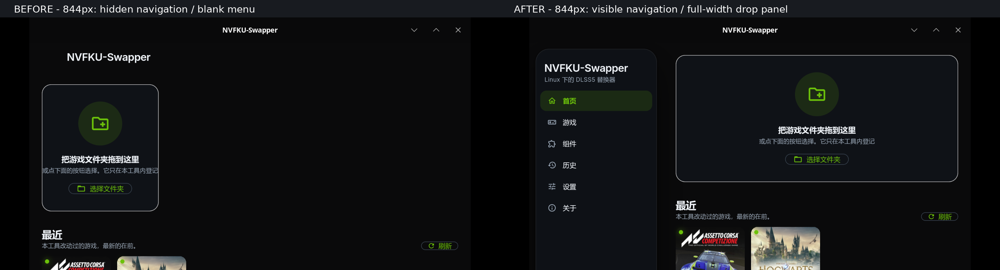

# UI 导航和布局修复：运行与视觉验证

## 实际复现与修复

环境：Flutter 3.47.5 / Dart 3.13.4，Linux GTK3 runner，niri/Wayland，显示缩放 1.5。实际启动 Linux Release，并通过合成器截图检查，不仅依靠 widget 测试。

| 问题 | 原因及处理 |
| --- | --- |
| 默认 844×1011 逻辑像素平铺窗口没有常驻侧边栏 | 原断点 900px 把正常桌面平铺视为移动布局；改为 760px，760px 及以上保留常驻导航。 |
| 窄窗口左上角导航按钮看不见 | 原 Release 字体不包含菜单 U+E3DC；显式使用常量 `Icons.menu` 并添加本地化 tooltip、打开抽屉动作。 |
| 1200px 宽窗口侧边栏垂直居中 | 外层 Row 默认不拉伸，侧边栏按内容收缩；改为纵向 stretch，内部仍可滚动。 |
| 首页拖放框收缩，中文提示裁切 | DropZone 只按内容决定宽度；改为填满内容区域并添加水平内边距。 |

源代码：[app.dart](../app/lib/src/app.dart#L416-L450)、[home_view.dart](../app/lib/src/home_view.dart)。此次只针对导航/布局修复；原有未提交的其他审查修改保留，没有提交或推送。

### Release 缓存注意事项

首次增量重建虽然退出码为 0，但实际运行和字体 cmap 检查仍发现菜单缺失（字体 40 个码点）。因此不能以“构建成功”代替视觉验证。

执行 `flutter clean && flutter pub get && flutter build linux --release` 后，字体包含 43 个码点，菜单 U+E3DC 存在；实际窄窗口也显示了菜单。可以确认本次增量资产存在陈旧字体现象，但未进一步证明是 Flutter SDK 哪个缓存环节的缺陷。

## 自动检查

- 全量 `flutter test`：**269 项通过**。
- `flutter analyze`：**No issues found**。
- Linux clean Release：**构建成功**。
- 新增 [navigation_layout_regression_test.dart](../app/test/navigation_layout_regression_test.dart)：52 项，覆盖原复现的导航可达性、侧边栏纵向尺寸、首页卡片宽度、抽屉打开/选择/关闭，以及 760/844px、中英文、深浅主题、2×文本缩放和六个主页面组合。
- 既有 accessibility 测试仍覆盖更窄窗口与高文字缩放。

## 实际运行检查

启动的是 [clean Release 可执行文件](../app/build/linux/x64/release/bundle/nvfku_ui)，不是旧发行包。

- 844px：常驻侧边栏可见，首页卡片完整显示中文提示。
- 1200px：侧边栏从顶部铺满窗口，首页拖放卡片填满内容区。
- 组件、历史、设置、关于：实际用 Tab/Enter 导航，分别在 1200px 和 844px 捕获截图；844px 截图逐页检查，没有发现布局溢出或导航消失。
- 游戏：1200px 实际查看；600px 从抽屉选择游戏后，抽屉关闭、游戏页显示，菜单仍可见。
- 600px：菜单按钮可见；通过键盘打开抽屉，六个导航项可见；选择游戏成功。
- 未进行真实游戏安装、替换、回滚、重新扫描或设置保存。

## 视觉证据

以下均来自实际 native Release 的合成器截图。首页截图只保留上半部分，避免展示活动日志中的本地路径；没有重绘应用内容。原始全窗口截图留在本机缓存目录。

- [600px 菜单按钮](screenshots/ui-navigation-fixes-20261007/narrow-menu.png)
- [600px 打开的抽屉](screenshots/ui-navigation-fixes-20261007/narrow-drawer.png)
- [抽屉选择后的游戏页](screenshots/ui-navigation-fixes-20261007/narrow-games.png)
- [844px 设置页](screenshots/ui-navigation-fixes-20261007/tiled-settings.png)

## 验证边界

本次构建并检查本机 Linux Release bundle；未重新生成之前的 tar/deb/AppImage 发行物，旧发行物不包含此次 UI 修复。未验证其他发行版、屏幕阅读器、远程 CI 或帧率表现。GTK 的 Atk 警告仍会输出，但未阻止本次应用渲染；不据此声称辅助技术兼容性已验证。
